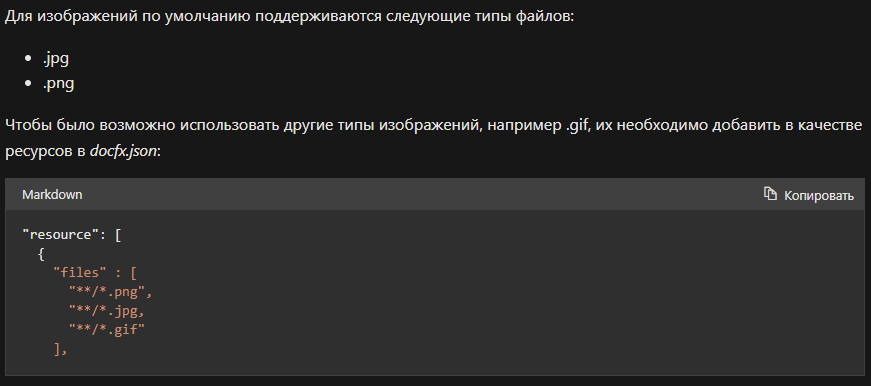

# Инструкция по начальным командам в Git
* list
* list 2

## Before init

> git config --global user.name "Name"

> git config --global user.email "E-mail"

## Basic Git commands

* git init - Initialization of Git in current folder.

* git status - Show changes in repository.

* git diff - show differences between current files and last commited.

* git add .\file.ext - add file in the repository.

* git add --all - add all files in repository folder into Git.

* git add *.md - add all files with md extension.

* git commit - commit changes of added files.

* git log - show log of committed files with commit hash.

* git checkout **first 4 digits of hash num** - switch to commit with entered hash num.

* git checkout master - wsitch to branch "master"

# Lists

1. Numbered list item 1
2. Numbered list item 2
3. Numbered list item 3

* list item 1
* list item 2
* list item 3
# Header 1
## Header 2
 __Bold__

 _Italic_

 *Alt Italic*

 **Alt Bold**
 
